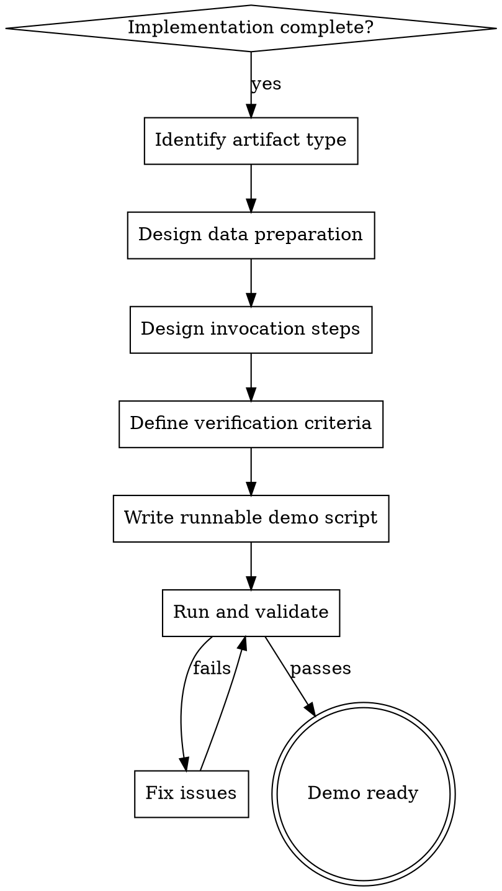

# Designing Demo Playbooks

## Overview

A demo playbook is a complete, runnable validation script that proves the implementation works. It includes prepared data, exact invocation commands, and expected outputs. **Core principle: If you cannot demonstrate it, you cannot ship it.**

## When to Use

- Feature or project implementation is complete (code written, tests passing)
- User asks "how do I run this?" or "show me it works"
- Preparing for code review, stakeholder demo, or handoff
- Need integration verification beyond unit tests
- Need to validate end-to-end flows with real data

**When NOT to use:**
- Implementation is not yet complete (use TDD/planning skills first)
- Only unit tests are needed (demo playbooks cover integration/e2e scenarios)

## Demo Design Flowchart



## Core Pattern: The 4 Elements of Every Demo

Every demo playbook must include these four elements, regardless of technology:

1. **Preparation**: What data, config, or state must exist before running?
2. **Invocation**: Exact commands or steps to trigger the feature
3. **Verification**: How to confirm the output/behavior is correct?
4. **Cleanup** (if needed): How to reset state for repeat runs?

## Artifact-Specific Quick Reference

### Web Application

| Element | What to Prepare |
|---------|----------------|
| Preparation | Seed database, mock API responses, create test users, set environment variables |
| Invocation | `npm run dev` or `docker compose up`, then browser URLs or curl commands |
| Verification | Screenshot expectations, HTTP status codes, response payloads, UI state changes |
| Cleanup | `docker compose down`, truncate tables, remove test files |

### Java HTTP Server (Spring Boot / JAX-RS / etc.)

| Element | What to Prepare |
|---------|----------------|
| Preparation | Application.yml config, H2/Postgres seed data, auth tokens, environment variables |
| Invocation | `mvn spring-boot:run` or `java -jar`, then `curl` / `httpie` / Postman collection |
| Verification | HTTP 200/201 responses, JSON schema validation, header checks, log assertions |
| Cleanup | Drop test database, revoke tokens, stop server |

### Java Dubbo Server (RPC)

| Element | What to Prepare |
|---------|----------------|
| Preparation | ZooKeeper/Nacos registry running, provider service up, interface definitions ready |
| Invocation | GenericService call, Dubbo admin, or Java client with `@Reference` |
| Verification | RPC response objects, serialization correctness, timeout/retries behavior |
| Cleanup | Unregister providers, clear registry entries |

### Command Line Tool

| Element | What to Prepare |
|---------|----------------|
| Preparation | Test input files, environment variables, config files, stdin data |
| Invocation | Exact command with all flags: `mytool --input file.txt --output result.json` |
| Verification | Exit code (0 = success), stdout/stderr content, output file contents |
| Cleanup | Remove generated output files, reset env vars |

### Desktop Application

| Element | What to Prepare |
|---------|----------------|
| Preparation | Test documents, sample images/videos, user accounts, window size config |
| Invocation | Launch binary or `npm run electron`, then UI automation or manual steps |
| Verification | Screenshot diff, file output verification, state persistence checks |
| Cleanup | Delete generated files, reset preferences, close application |

## Implementation Steps

1. **Read the requirements document** to identify the key scenarios to demonstrate
2. **Examine the project structure** to determine artifact type and build system
3. **Verify the project builds and runs** before designing the demo — fix any missing main classes, plugins, or config
4. **Check existing tests** for data setup patterns you can reuse
5. **Design the happy-path scenario** first, then edge cases if needed
6. **Write a runnable script** (shell, make target, npm script, or Java main) that:
   - Sets up data
   - Invokes the feature
   - Asserts the result with **multiple checks per scenario** (not just HTTP status)
   - Cleans up automatically even on failure
7. **Run the script yourself** and fix any issues
8. **Document any manual steps** that cannot be automated

### Script Quality Standards

| Practice | Why It Matters |
|----------|---------------|
| `set -euo pipefail` | Fails fast on any error, catches unset variables, catches pipeline failures |
| `trap cleanup EXIT` | Ensures cleanup runs even if the script fails mid-demo |
| Multiple assertions per scenario | HTTP 200 with wrong body is still a bug; verify content, not just status |
| PASS/FAIL counters | Makes demo output scannable for reviewers |
| `PROJECT_DIR="$(cd "$(dirname "$0")" && pwd)"` | Scripts work regardless of where they are invoked from |

## Superpowers Workflow Integration

| Phase | Demo Playbook Role |
|-------|-------------------|
| `verification-before-completion` | Demo script serves as integration test; run it before claiming done |
| `requesting-code-review` | Include demo script in PR; reviewers can run it to verify behavior |
| `finishing-a-development-branch` | Demo is part of delivery artifact; merge only after demo passes |

**Integration rule:** After writing a demo playbook, treat it as a required check. If the demo fails, the feature is not complete.

## Common Mistakes

| Mistake | Fix |
|---------|-----|
| Assuming the reviewer knows how to start the service | Write exact startup commands, including prerequisites |
| Using production data in demos | Always use synthetic test data with known expected outputs |
| Hardcoding absolute paths | Use relative paths or environment variables |
| Omitting auth/token setup | Document how to obtain or mock credentials |
| Forgetting cleanup | Repeat runs fail due to accumulated state; always include cleanup |
| Only testing the happy path | Add at least one error case if the feature handles errors |
| Demo script is not executable | `chmod +x` shell scripts, include shebang, test on target OS |
| Single-assertion verification | Verify both status/code AND content/body per scenario |
| Manual cleanup that skips on failure | Use `trap cleanup EXIT` so cleanup always runs |
| Not checking project builds first | Run `mvn compile` / `npm install` before designing the demo; fix missing classes/plugins |
| Fragile shell scripts | Use `set -euo pipefail` to catch errors early |
| No pass/fail summary | Add counters so reviewers can scan results in seconds |

## Red Flags — STOP and Complete the Demo

- "You can just look at the code"
- "It works on my machine"
- "The unit tests cover it"
- "It's self-explanatory"
- "I'll write the demo later"

**All of these mean: Write the demo playbook now. No exceptions.**

## Example: Java HTTP Server Demo Script

```bash
#!/bin/bash
set -euo pipefail

PROJECT_DIR="$(cd "$(dirname "$0")" && pwd)"
BASE_URL="http://localhost:8080"
SERVER_PID=""
PASS_COUNT=0
FAIL_COUNT=0

pass() { echo "PASS: $1"; ((PASS_COUNT++)) || true; }
fail() { echo "FAIL: $1"; ((FAIL_COUNT++)) || true; }

cleanup() {
    if [ -n "$SERVER_PID" ] && kill -0 "$SERVER_PID" 2>/dev/null; then
        kill "$SERVER_PID" 2>/dev/null || true
    fi
    rm -f /tmp/demo_*.json
}
trap cleanup EXIT

# --- Preparation: build and start ---
mvn package -q -DskipTests -f "$PROJECT_DIR/pom.xml"
java -jar "$PROJECT_DIR/target/app.jar" > /tmp/demo_server.log 2>&1 &
SERVER_PID=$!

for i in {1..30}; do
    curl -s -o /dev/null "$BASE_URL/api/users" 2>/dev/null && break
    sleep 1
done

# --- Scenario 1: Create user ---
curl -s -X POST "$BASE_URL/api/users" \
  -H "Content-Type: application/json" \
  -d '{"name":"Alice","email":"alice@example.com"}' \
  -o /tmp/demo_create.json

if grep -q '"id"' /tmp/demo_create.json; then
    pass "User created with ID"
else
    fail "No ID in response"
fi

if grep -q '"name":"Alice"' /tmp/demo_create.json; then
    pass "Name matches"
else
    fail "Name mismatch"
fi

# --- Scenario 2: Error case (duplicate) ---
HTTP_CODE=$(curl -s -o /dev/null -w "%{http_code}" -X POST "$BASE_URL/api/users" \
  -H "Content-Type: application/json" \
  -d '{"name":"Alice2","email":"alice@example.com"}')

if [ "$HTTP_CODE" = "409" ]; then
    pass "Duplicate correctly rejected (409)"
else
    fail "Expected 409, got $HTTP_CODE"
fi

# --- Summary ---
echo ""
echo "Passed: $PASS_COUNT  Failed: $FAIL_COUNT"
[ "$FAIL_COUNT" -eq 0 ] || exit 1
```
